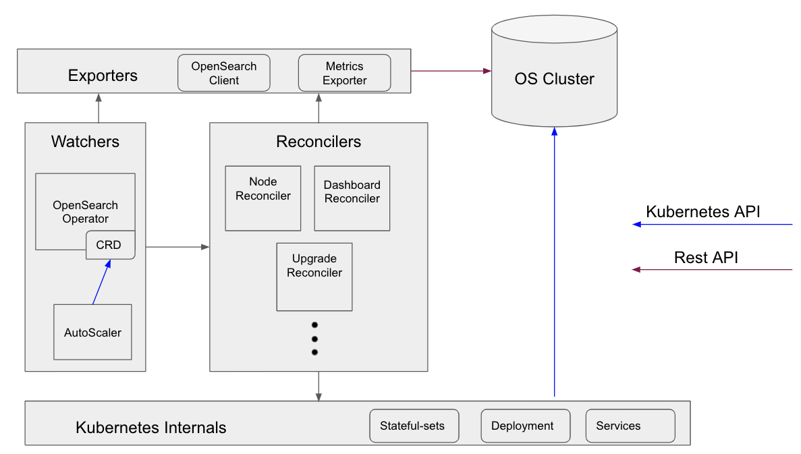

# K8s Operator
The k8s OpenSearch Operator is composed of multiple entities, all deployed on kubernetes, allowing for automating the deployment, provisioning, management, and orchestration of OpenSearch clusters.

# The operator entities are divided into the following categories:
- Triggers
- Reconcilers
- Exporters

# The Triggers responsibilities
1. Watch for any change in the CRD (Operator) or any anomaly defined by user (AutoScaler)  
2. Trigger required reconcile components 
3. Allow/Block parallel reconcile work  

# Reconcilers
1. Initiated by the Triggers components. 
2. Responsible for executing its logic end to end.
3. Each Reconciler manage it own status.

# Exporters
1. Export metrics and OS knowledge.

Most interactions with the operator will be performed through the OpenSearch operator.
This can be done in 2 ways:
1. Updating its CRD. 
2. Sending API request.

- On both cases the flow will be as follow:
1. The Operator validates parallel is allowed.
2. The Operator will trigger relevant reconcilers.
3. Each reconciler will perform its end to end logic. take care of needed cleanups and status management. 