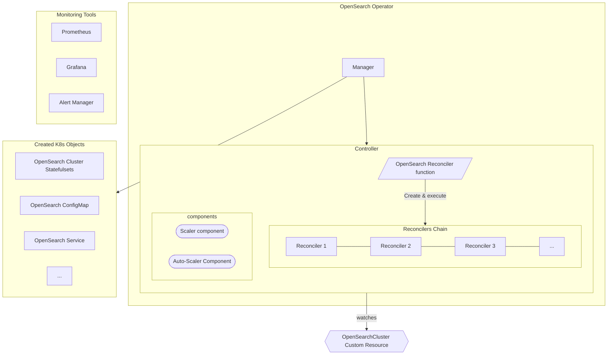

# OpenSearch K8s Operator: High Level Design
The k8s OpenSearch Operator is a software, written following the pattern of [Kubernetes Operator](https://kubernetes.io/docs/concepts/extend-kubernetes/operator/), with the goal of automating the provisioning, management, and orchestration of OpenSearch clusters on Kubernetes

## High Level Overview
The OpenSearch Kubernetes Operator, as any other operator, is a process, deployed to Kubernetes as a container. It has several functionalities:
1. Provisioning: Deploying OpenSearch Clusters to Kubernetes, based on a descriptor provided by the user. The descriptor can be changed by the user, and the environment may also change (e.g. machines terminates, etc.). The operator responds and makes sure the running OpenSearch Cluster and other components it deploys, matches the descriptor. The OpenSearch clusters deployed are configured based on the descriptors.  
2. Monitoring: Deploying tools needed to allow the person operating OpenSearch to have ready-made working dashboards and alerts.
3. Auto-scaling: Based on OpenSearch metrics, the number of OpenSearch pods will be changed to match current workload.

### Operator Configuration
The descriptor, provided by the user, is a configuration data structure specifying:
* Cluster composition: How many pods and which role they will run? What's their pod specification (cpu, memory, ...)? 
* Cluster configuration: Configuration of OpenSearch
* Operator Configuration: Security, Monitoring, Auto Scaling, OpenSearch Dashboard, ...

The descriptor is a [Custom Resource](https://kubernetes.io/docs/concepts/extend-kubernetes/api-extension/custom-resources/) which effectively is a YAML answering to a schema (called a [Custom Resource Definition](https://kubernetes.io/docs/concepts/extend-kubernetes/api-extension/custom-resources/#customresourcedefinitions)). The operator is bundled with a [schema](../../opensearch-operator/config/crd/bases/opensearch.opster.io_opensearchclusters.yaml) for this resource which is deployed when deploying this operator. 

Each custom resource answering to that schema (kind: `OpenSearchCluster`) represents a **single** OpenSearch cluster. 

See [Custom Resource Reference Guide](crd.md) for a full reference to the custom resource.

### Architecture Diagram

### Provisioning 
The operator contains a Manager, which manages a Controller for its Custom Resource (`OpenSearchCluster`). It is mainly a listener on queue, which gets filled when ever a change has been made to one of the custom resources. The action is adjusting the deployed cluster to match the desired configuration specified in the custom resource. It can be a simple change to the Security configuration which may only update dynamic settings using OpenSearch API,or it can also be a change to the pod spec, increasing memory requirements from 10gb to 12gb. The latter requires a series of steps to accomplish that.

Once a change has been detected it calls the Controller with the changed custom resource ID, which calls the OpenSearch Reconciler reconcile function. That reconciler is the main entry for the whole operator. Its goal is to modify/create/delete the OpenSearch Cluster and other deployed tools (e.g. Prometheus) reflecting the changes made to the custom resource. 

The OpenSearch Reconciler reconcile function is primarily composed of two types of elements: Reconcilers and Components. The Reconcilers main job is to update/create the deployed Kubernetes objects representing the OpenSearch Cluster and other various software the Operator needs. If we take the Custom Resource YAML and split into it logical parts (i.e. fields), then a Reconciler is mapped to a specific part (field). The operators have the following Reconcilers:
* Cluster Reconciler: mapped to `nodePools`. In charge of OpenSearch cluster
* Dashboards Reconciler: mapped to `dashboards`. In charge of [OpenSearch Dashboards](https://opensearch.org/docs/latest/dashboards/index/) 
* Configuration Reconciler - In charge of OpenSearch configuration
* TLS Reconciler - mapped to `security.tls`. In charge of TLS configuration (OpenSearch Security Plugin)
* `Securityconfig` Reconciler - mapped to `security.config`. In charge of the `securityconfig` with users and roles (OpenSearch Security plugin)

Each Reconciler, takes the up-to-date Custom Resource, extracts the relevant data it is in charge of, and then checks whether something needs to be created or modified. For example, the Cluster Reconciler, creates a StatefulSet based on the pool defined in `nodePools`, retrieves the current StatefulSet and compares to see if it has changed, mandating deploying it to Kubernetes. Some differences require a series of steps to be taken prior to that. For example, if the number of replicas has decreased (say from 5 to 3), then assuming Graceful scale-down was defined, it calls the Scaler component to start the process of gracefully removing data from that pod, before decreasing the number of pods. Since some actions, especially removing shards away from an OpenSearch Node, takes time, a Reconciler needs to acknowledge a certain event was done before it can proceed to execute other steps.

The Reconcilers and Components communicate via a `ReconcilerContext` that is passed between them which they can use to share information during one reconcile run (for example the TLS reconciler uses it to tell the cluster reconciler to mount secrets containing TLS certificates to the pods). To communicate between runs and persist state the Status object of the Custom Resource can be used. It contains a data structure that exposes the current status of each reconciler and component. This has the double advantage of sharing state between Reconcilers and also make it visible to the user.

The OpenSearch Reconciler retrieves the current custom resource, based on the ID, from Kubernetes (using its API) and checks to see whether it was deleted (by checking if the custom resource has deletion timestamp field in it). If it was, it calls `DeleteResources` function on all Reconcilers in the chain, then it removes the Finalizer that was placed on the custom resource. All Kubernetes objects created by the operator are using [Owner Reference](https://kubernetes.io/blog/2021/05/14/using-finalizers-to-control-deletion/#owner-references) to the custom resource, thus are deleted in a cascading fashion by Kubernetes once the finalizer has been removed. The `DeleteResources` function, each Reconciler can implement, has the goal of cleaning up any resources that can not be cleaned using the Owner Reference mechanism. 

If it was created or updated, the OpenSearch Reconciler uses the retrieved custom resource YAML to parse it and produces a data structure representing it. It then executes the chain of Reconcilers, passing the Custom Resource data structure as main input.

Each Reconciler executes and returns a special Result structure, that says two things:
* Requeue: true/false. If true, it will fill the queue the controller is listening on with a message with the same resource ID. False - it won't do it, hence the OpenSearch Reconciler will only get called upon another change to the custom resource
* RequeueAfter: Duration. If Requeue is true, the message will be inserted into the queue in RequeueAfter duration.

If one of the Reconcilers returns an error, or requests a Requeue (via the Result object), then the OpenSearch Reconciler returns the same result object, meaning the OpenSearch Reconciler will be called again in RequeueAfter seconds, calling the chain of reconcilers again.

Regardless of the Requeue (true/false) returned, the reconciler updates its status in the Status element of the custom resource.
Notice that Reconcilers in the reconcilers chain do not save any state in their struct instance. They get instantiated on each call to the OpenSearch Reconciler reconcile function so must be treated as stateless and must store any state to be persisted between runs in the Status object.

If all Reconcilers have finished successfully, and didn't ask for Requeue, then a Requeue of 30seconds will be returned. This is done to make sure we keep checking if nothing external have changed. For example, if a Kubernetes secret has changed, we won't currently get notified on it, thus a Busy Wait style of implementation was chosen. 

Aside from Reconcilers we also have Components. Those are software objects whose responsibilities don't fall into the category of reconciling Kubernetes objects based on the Custom Resource. The components we have are:
1. Scaler: in charge of doing graceful scale down of an OpenSearch Node.
2. Auto-Scaler (Not written yet): Will respond to OpenSearch metrics polled periodically from Prometheus and modify amount Data Nodes and/or Coordinators of the cluster to respond to varying load.

### Monitoring

The Operator deploys Prometheus with built-in dashboards and Alerts, Grafana and Alerts Manager providing the user a batteries-included experience for monitoring OpenSearch. The complete reference is included in the [Monitoring Design](monitoring.md). 

### Security

The operator wants to accomplish two goals from security standpoint: Secure from the get-go and ease of configuring OpenSearch Security Plugin. The complete design for this section is in the [Security Design](security.md)

### Interacting with the Operator

Updating the Custom Resource is currently the only way to communicate with the Operator. 

