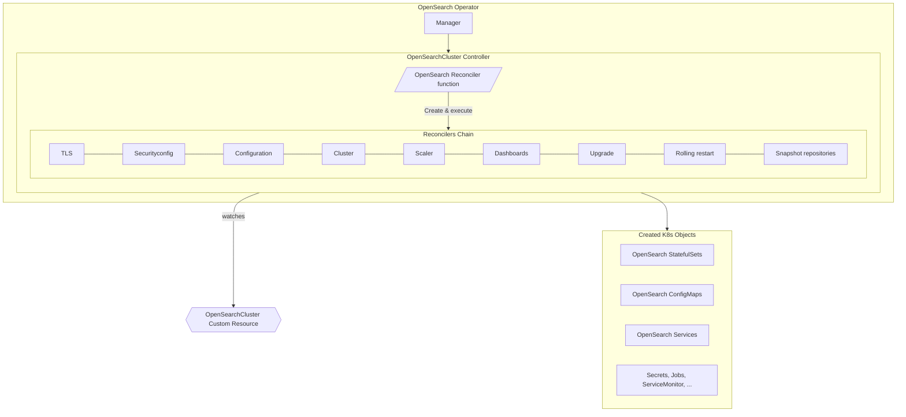

# OpenSearch K8s Operator: High Level Design
The OpenSearch Kubernetes Operator follows the [Kubernetes Operator](https://kubernetes.io/docs/concepts/extend-kubernetes/operator/) pattern. Its goal is to automate the provisioning, management and orchestration of OpenSearch clusters on Kubernetes.

## Design documents

* [Cluster configuration](configuration.md): how `opensearch.yml` is rendered and when configuration changes restart pods
* [Rolling restart](rolling-restart-improvements.md): how pods with a pending revision are restarted
* [Upgrades](upgrade.md): version upgrades of a running cluster
* [Security](security.md): TLS and securityconfig handling
* [OpenSearch API resources](opensearch-rbac.md): users, roles, role mappings, tenants, action groups, ISM policies, templates and snapshot policies as custom resources
* [Monitoring](monitoring.md): metrics exporter plugin, ServiceMonitor and operator metrics
* [CRD reference](crd.md): generated API reference

## High Level Overview
The operator runs in Kubernetes as a container. It:
1. Provisions OpenSearch clusters (and optionally OpenSearch Dashboards) from a descriptor provided by the user, and keeps the running cluster matching the descriptor when the descriptor or the environment changes (for example when nodes are terminated).
2. Performs day-2 operations: graceful scale-down, rolling restarts on configuration changes, version upgrades, TLS certificate rotation and snapshot repository registration.
3. Manages OpenSearch objects (users, roles, ISM policies, templates, ...) declared as custom resources.
4. Optionally enables metrics collection: it installs the Prometheus exporter plugin and creates a `ServiceMonitor` for an existing Prometheus Operator installation. It does not deploy Prometheus, Alertmanager or Grafana.

The operator does not auto-scale clusters. The number of pods per node pool is whatever the descriptor specifies.

### Operator Configuration
The descriptor, provided by the user, specifies:
* Cluster composition: node pools, their roles, replica counts and pod specification (CPU, memory, storage, ...)
* Cluster configuration: configuration of OpenSearch
* Additional features: security, monitoring, OpenSearch Dashboards, snapshot repositories, ...

The descriptor is a [Custom Resource](https://kubernetes.io/docs/concepts/extend-kubernetes/api-extension/custom-resources/) of kind `OpenSearchCluster`, validated by a [Custom Resource Definition](https://kubernetes.io/docs/concepts/extend-kubernetes/api-extension/custom-resources/#customresourcedefinitions). The operator is bundled with the [schema](../../opensearch-operator/config/crd/bases/opensearch.org_opensearchclusters.yaml) for this resource (API group `opensearch.org/v1`). The older `opensearch.opster.io/v1` API group is deprecated; a migration controller keeps resources in the old group in sync with the new one.

Each `OpenSearchCluster` resource represents a **single** OpenSearch cluster.

See the [Custom Resource Reference Guide](crd.md) for a full reference to the custom resource.

### Architecture Diagram

```mermaid
  flowchart TD
      subgraph operator [OpenSearch Operator]
          direction LR
          manager[Manager] -->controller
      end
      subgraph controller [OpenSearchCluster Controller]
          direction TB
          opensearch-reconciler[/OpenSearch Reconciler function/] --Create & execute -->reconcilers
          subgraph reconcilers [Reconcilers Chain]
              direction LR
              tls[TLS] --- securityconfig[Securityconfig] --- configuration[Configuration] --- cluster[Cluster] --- scaler[Scaler] --- dashboards[Dashboards] --- upgrade[Upgrade] --- restart[Rolling restart] --- snapshotrepo[Snapshot repositories]
          end
      end

      controller-- watches -->cr{{OpenSearchCluster Custom Resource}}

      subgraph kubernetes-objects-created [Created K8s Objects]
          direction LR
          opensearch-cluster-statefulsets[OpenSearch StatefulSets]
          openseach-config-map[OpenSearch ConfigMaps]
          opensearch-service[OpenSearch Services]
          secrets[Secrets, Jobs, ServiceMonitor, ...]
      end

      controller --> kubernetes-objects-created
```

### Provisioning
The Manager runs a Controller for `OpenSearchCluster`. The controller is triggered whenever an `OpenSearchCluster` or one of the objects it owns (Pods, StatefulSets, Services, ConfigMaps, Secrets, Deployments, PVCs) changes, and calls the OpenSearch Reconciler function with the resource ID. The OpenSearch Reconciler is the main entry point of the operator. Its goal is to create, modify or delete the Kubernetes objects and OpenSearch settings so they reflect the custom resource. A change can be as simple as a setting applied through the OpenSearch API, or a change to the pod spec that requires a series of steps.

The OpenSearch Reconciler runs a chain of Reconcilers. Each one is mapped to a part of the custom resource, and they run in this order:
* TLS Reconciler: mapped to `security.tls`. Generates or loads TLS certificates and adds the TLS settings to the node configuration
* Securityconfig Reconciler: mapped to `security.config`. Builds the securityconfig and applies it, either with the `securityadmin.sh` update job or through the security plugin's default init
* Configuration Reconciler: renders `opensearch.yml` into ConfigMaps and calculates the per-node-pool config hash
* Cluster Reconciler: mapped to `nodePools` and `general`. Creates Services, StatefulSets, PDBs, the bootstrap pod and the ServiceMonitor, resizes volumes, updates the cluster health status, and recovers a cluster that uses only `emptyDir` storage after it lost its data by recreating it
* Scaler Reconciler: graceful scale-up and scale-down of node pools, one node at a time. With `confMgmt.smartScaler` data is drained from a node before it is removed. Master-eligible nodes are added to the voting config exclusions before removal
* Dashboards Reconciler: mapped to `dashboards`. Deploys [OpenSearch Dashboards](https://docs.opensearch.org/latest/dashboards/)
* Upgrade Reconciler: rolls out `general.version` changes node by node, see [Upgrades](upgrade.md)
* Rolling Restart Reconciler: restarts pods that have a pending StatefulSet revision, see [Rolling restart](rolling-restart-improvements.md)
* Snapshot Repository Reconciler: mapped to `general.snapshotRepositories`. Registers snapshot repositories in OpenSearch

Each Reconciler takes the up-to-date custom resource, extracts the data it is in charge of, and checks whether something needs to be created or modified. For example, the Cluster Reconciler builds a StatefulSet for each pool in `nodePools`, compares it with the existing StatefulSet and applies the difference. Some changes require a series of steps. For example, when the number of replicas decreases, the Scaler removes one node at a time and waits for the preparation (draining, voting exclusions) to finish before it removes the next one. Since such actions take time, a Reconciler records progress and continues on a later run.

The Reconcilers communicate through a `ReconcilerContext` that is passed between them during one reconcile run. For example, the TLS reconciler uses it to tell the cluster reconciler which secrets with TLS certificates to mount into the pods, and to add settings to `opensearch.yml`. State that must survive between runs is stored in the Status of the custom resource (`status.componentsStatus`, `status.version`, `status.initialized`, ...). This shares state between Reconcilers and also makes it visible to the user. Reconcilers are instantiated on every run and must not keep state in their struct.

The OpenSearch Reconciler retrieves the current custom resource from Kubernetes and checks whether it is being deleted (deletion timestamp set). If so, it calls `DeleteResources` on the TLS, Securityconfig, Configuration, Cluster and Dashboards Reconcilers and then removes its finalizer. All Kubernetes objects created by the operator have an [Owner Reference](https://kubernetes.io/blog/2021/05/14/using-finalizers-to-control-deletion/#owner-references) to the custom resource, so Kubernetes deletes them in a cascade once the finalizer is removed. `DeleteResources` cleans up anything that the Owner Reference mechanism cannot.

Otherwise the OpenSearch Reconciler runs the chain. Each Reconciler returns a Result and an error:
* An error stops the chain and the request is retried, unless it is a terminal error (a permanent configuration or validation problem, such as an invalid version change). Terminal errors are counted in the `opensearch_operator_cluster_reconcile_error` metric and logged, and the chain continues.
* `Requeue: true` stops the chain, so in-progress work such as scaling or an upgrade step is not interleaved with later reconcilers.
* `RequeueAfter` only: the chain continues, and the shortest requested delay is used.

When the whole chain completes, the reconcile is requeued after the shortest requested delay, or after 30 seconds by default. This periodic requeue picks up changes that do not trigger a watch event, for example changes to user-supplied secrets.

### Other controllers

The OpenSearch API resources (`OpensearchUser`, `OpensearchRole`, `OpensearchUserRoleBinding`, `OpensearchTenant`, `OpensearchActionGroup`, `OpenSearchISMPolicy`, `OpensearchIndexTemplate`, `OpensearchComponentTemplate`, `OpensearchSnapshotPolicy`) each have their own controller that reconciles them against the OpenSearch API of the referenced cluster. See [OpenSearch API resources](opensearch-rbac.md).

### Monitoring

When monitoring is enabled, the operator installs the Prometheus exporter plugin on the OpenSearch nodes and creates a `ServiceMonitor` for an existing Prometheus Operator installation. The operator also exposes its own metrics. See the [Monitoring Design](monitoring.md).

### Security

The operator makes the OpenSearch Security plugin easy to set up: it can generate and rotate TLS certificates and manage the securityconfig. The security plugin is only enabled when TLS is configured. See the [Security Design](security.md).

### Interacting with the Operator

Updating the custom resources is the only way to communicate with the Operator.
