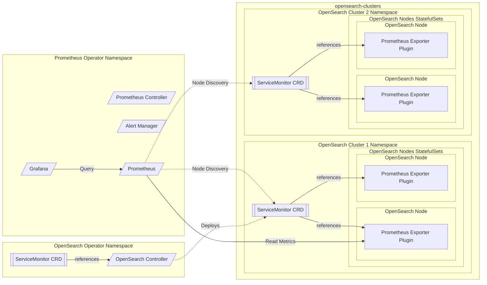

# Monitoring

## Content
- [Monitoring](#monitoring)
  - [Content](#content)
  - [Architecture](#architecture)
  - [Metrics](#metrics)
    - [Default go metrics](#default-go-metrics)
    - [Opensearch Node Metrics](#opensearch-node-metrics)
    - [Opensearch Controller Metrics](#opensearch-controller-metrics) 
  - [Task list](#task-list)

## Goals
This component has 2 goals: 
* Monitor OpenSearch clusters managed by the operator and the Operator itself.
* Supplying a getting started Monitoring and Alerting solution, allowing the user to immediately view the metrics from the first goal and have built in alerts from them

## Overview

### OpenSearch Monitoring
The most popular open source monitoring format today is Prometheus. The latter works by periodically pulling a http endpoint containing the metrics and their values in a format called [Prometheus Text Based Exposition format](https://github.com/prometheus/docs/blob/main/content/docs/instrumenting/exposition_formats.md). 
OpenSearch doesn't contain a native Prometheus text format endpoint (yet), there for the OpenSearch Operator will install an OpenSearch Plugin called [opensearch-prometheus-exporter](https://github.com/aparo/opensearch-prometheus-exporter) which exposes per node its Node Metrics and on a specific node it will also exposes Cluster and Indices metrics. 

### Operator Monitoring
The operator is a Go-based process, which will expose its metrics (per component) using the Prometheus Text Based Exposition format on default endpoint. 

### Getting Started Monitoring and Alerting solution
The most popular open source solution for monitoring and alerting today is Prometheus - serving as the time-series database the metrics will be written to and read from (queried) and as the alerting engine executing alerts. The most popular solution for viewing metrics on dashboards is Grafana. The OpenSearch operator will install them both and more:
* Prometheus: Will pull metrics from OpenSearch and OpenSearch Operator and write them into its own time series database. 
* Alert Manager: A component from Prometheus project which handle de-dup and notifications.
* Grafana: the UI for viewing the metrics, will come with pre-installed dashboards for those metrics.

Prometheus will be managed by Prometheus Operator, which will be installed by the helm charts of OpenSearch Operator.

## Architecture


- Permissions to view cluster metrics will be limited in Grafana

## Metrics

### OpenSearch Controller Metrics
#### Default Go Metrics
Default prometheus metrics sent by the go app. Here is a list of these metrics:
```
go_gc_duration_seconds
go_gc_duration_seconds_sum 
go_gc_duration_seconds_count 
go_goroutines 
go_info{version="go1.16.4"} 1
go_memstats_alloc_bytes 
go_memstats_alloc_bytes_total 
go_memstats_buck_hash_sys_bytes 
go_memstats_frees_total 
go_memstats_gc_cpu_fraction 
go_memstats_gc_sys_bytes 
go_memstats_heap_alloc_bytes 
go_memstats_heap_idle_bytes 
go_memstats_heap_inuse_bytes 
go_memstats_heap_objects
go_memstats_heap_released_bytes
go_memstats_heap_sys_bytes 
go_memstats_last_gc_time_seconds 
go_memstats_lookups_total 
go_memstats_mallocs_total 
go_memstats_mcache_inuse_bytes
go_memstats_mcache_sys_bytes
go_memstats_mspan_inuse_bytes 
go_memstats_mspan_sys_bytes 
go_memstats_next_gc_bytes 
go_memstats_other_sys_bytes 
go_memstats_stack_inuse_bytes 
go_memstats_stack_sys_bytes 
go_memstats_sys_bytes 
go_threads 
promhttp_metric_handler_requests_in_flight 1
promhttp_metric_handler_requests_total{code="200"} 0
promhttp_metric_handler_requests_total{code="500"} 0
promhttp_metric_handler_requests_total{code="503"} 0
```
The simple way to enable them is described here: [Instrumenting a go application for prometheus](https://prometheus.io/docs/guides/go-application/). 

These metrics will be collected from the controller.

#### Custom Metrics

The third group of metrics, which could be collected from the controller. Suggested metrics: 
| Metric  | Description |
| ------------- | ------------- |
| os_restart_total | Number of times a node has restarted |
|os_cluster_management_state_info | Management state used by the cluster |
| os_storage_info | Number of nodes using emphimeral or persistent storage |
| os_redundancy_policy_info | Redundancy policy used by the cluster |
| os_index_retention_seconds | Number of seconds that documents are | retained per policy operation |
| os_defined_delete_namespaces_total | Number of defined namespaces deleted per index policy |
| os_misconfigured_memory_resources_info | Number of nodes with misconfigured memory resources |

### OpenSearch Node Metrics

The [opensearch-prometheus-exporter](https://github.com/aparo/opensearch-prometheus-exporter) plugin includes metrics for each Node, and also Cluster level metrics and Index level metrics.

## Task list

- [ ] Default metrics publication
- [ ] Prometheus-plugin integration
- [ ] Opensearch controller metrics publication
- [ ] Deployment of the service-monitor for every clusters
- [ ] Deployment of the Prometheus-operator 
- [ ] Prometheus-operator integration
- [ ] Grafana dashboards development
- [ ] Grafana permissions testing


## Progress 

I choose to integrate with Aiven prometheus-exporter-plugin-for-opensearch (https://github.com/aiven/prometheus-exporter-plugin-for-opensearch). 

For working with that Operator monitoring feature the client must have Prometheus cluster already installed .

I added new boolean filed in general section that called "monitoring", if that filed is set to true the Aiven exporter will be added to PluginList and will be installed on the cluster.
Besides, a new ServiceMonitor will appear in the OS cluster namespace, that ServiceMonitor is configured to fetch metrics from the OS cluster by his selectors, by port 9200 from "/_prometheus/metrics" path. 
Aivan also added the option to configure that plugin inside "config/opensearch.yml" file, an option to add those configurations with the operator will be added soon.

* Please let me  know if you familiar with any OpenSearch Grafana dashboard, Aiven suppose to release a Grafana Dashboard in the future (https://github.com/aiven/prometheus-exporter-plugin-for-opensearch/issues/12).