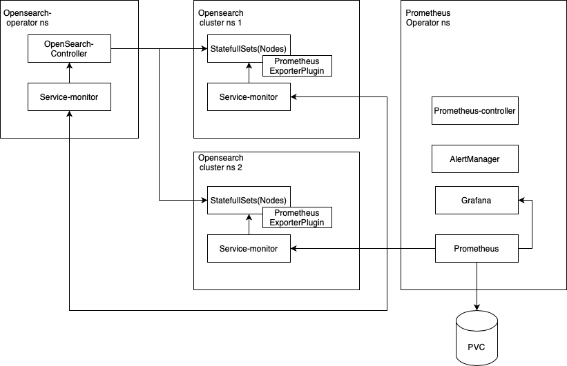

# Monitoring

## Content
- [Monitoring](#monitoring)
  - [Content](#content)
  - [Architecture](#architecture)
  - [Metrics](#metrics)
    - [Default go metrics](#default-go-metrics)
    - [Opensearch Node Metrics](#opensearch-node-metrics)
    - [Opensearch Controller Metrics](#opensearch-controller-metrics) 
  - [Task list](#task-list)

## Architecture



- Include prometheus-operator in OpenSearch-operator helm-chart.
- When deploying a cluster in namespace, the OpenSearch-operator will also deploy a service-monitor for that cluster.
- Permissions to view cluster metrics will be limited in Grafana

## Metrics

### Default go metrics

Default prometheus metrics sent by the go app. Here is a list of these metrics:
```
go_gc_duration_seconds
go_gc_duration_seconds_sum 
go_gc_duration_seconds_count 
go_goroutines 
go_info{version="go1.16.4"} 1
go_memstats_alloc_bytes 
go_memstats_alloc_bytes_total 
go_memstats_buck_hash_sys_bytes 
go_memstats_frees_total 
go_memstats_gc_cpu_fraction 
go_memstats_gc_sys_bytes 
go_memstats_heap_alloc_bytes 
go_memstats_heap_idle_bytes 
go_memstats_heap_inuse_bytes 
go_memstats_heap_objects
go_memstats_heap_released_bytes
go_memstats_heap_sys_bytes 
go_memstats_last_gc_time_seconds 
go_memstats_lookups_total 
go_memstats_mallocs_total 
go_memstats_mcache_inuse_bytes
go_memstats_mcache_sys_bytes
go_memstats_mspan_inuse_bytes 
go_memstats_mspan_sys_bytes 
go_memstats_next_gc_bytes 
go_memstats_other_sys_bytes 
go_memstats_stack_inuse_bytes 
go_memstats_stack_sys_bytes 
go_memstats_sys_bytes 
go_threads 
promhttp_metric_handler_requests_in_flight 1
promhttp_metric_handler_requests_total{code="200"} 0
promhttp_metric_handler_requests_total{code="500"} 0
promhttp_metric_handler_requests_total{code="503"} 0
```
The simple way to enable them is described here: [Instrumenting a go application for prometheus](https://prometheus.io/docs/guides/go-application/). 

These metrics will be collected from the controller.

### Opensearch Node Metrics

The second group of metrics that could be collected from the cluster nodes (kubernetes pods). By default, OpenSearch does not produce metrics in a Prometheus like format. To export opensearch metrics, we will include the following plugin in the operator: [opensearch-prometheus-exporter](https://github.com/aparo/opensearch-prometheus-exporter). 

### OpenSearch Controller Metrics

The third group of metrices, which could be collected from the controller. Suggested metrics: 
| Metric  | Description |
| ------------- | ------------- |
| os_restart_total | Number of times a node has restarted |
|os_cluster_management_state_info | Management state used by the cluster |
| os_storage_info | Number of nodes using emphimeral or persistent storage |
| os_redundancy_policy_info | Redundancy policy used by the cluster |
| os_index_retention_seconds | Number of seconds that documents are | retained per policy operation |
| os_defined_delete_namespaces_total | Number of defined namespaces deleted per index policy |
| os_misconfigured_memory_resources_info | Number of nodes with misconfigured memory resources |

### Task list

- [ ] Default metrics publication
- [ ] Prometheus-plugin integration
- [ ] Opensearch controller metrics publication
- [ ] Deployment of the service-monitor for every clusters
- [ ] Deployment of the Prometheus-operator 
- [ ] Prometheus-operator integration
- [ ] Grafana dashboards development
- [ ] Grafana permissions testing
