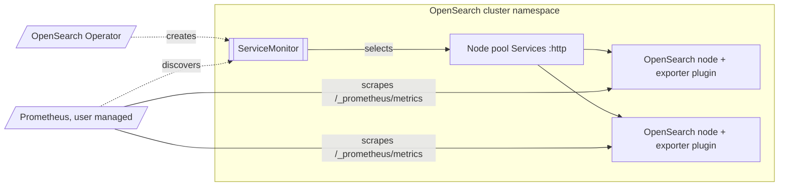

# Monitoring

## Goals

* Expose metrics for the OpenSearch clusters managed by the operator.
* Expose metrics about the operator itself.

The operator does not install Prometheus, Alertmanager or Grafana. It expects a Prometheus that is managed by the [Prometheus Operator](https://github.com/prometheus-operator/prometheus-operator) to already run in the Kubernetes cluster, and only creates a `ServiceMonitor` for each OpenSearch cluster that has monitoring enabled.

## OpenSearch cluster metrics

When `spec.general.monitoring.enable` is true, the operator:

1. Adds the Prometheus exporter plugin to the plugin list of every node. By default this is the [opensearch-prometheus-exporter](https://github.com/opensearch-project/opensearch-prometheus-exporter) release that matches `spec.general.version` (the plugin formerly published by Aiven as `prometheus-exporter-plugin-for-opensearch`). `monitoring.pluginUrl` overrides the download URL.
2. Creates a `ServiceMonitor` named `<cluster>-monitor` in the cluster namespace that scrapes `/_prometheus/metrics` on the `http` port of every node, selected through the per-node-pool services (the cluster-wide service is excluded to avoid double scraping). The scrape interval (`scrapeInterval`, default `30s`), basic-auth secret (`monitoringUserSecret`, default `<cluster>-admin-password`), TLS settings (`tlsConfig`), extra labels and relabelings are configurable.

If the `ServiceMonitor` CRD is not installed, the operator logs this, emits a Warning event and skips the `ServiceMonitor`. When monitoring is disabled again, the `ServiceMonitor` is deleted.

```mermaid
flowchart LR
  subgraph cluster-ns [OpenSearch cluster namespace]
    sm[[ServiceMonitor]] -- selects --> svc[Node pool Services :http]
    svc --> n1[OpenSearch node + exporter plugin]
    svc --> n2[OpenSearch node + exporter plugin]
  end
  operator[/OpenSearch Operator/] -. creates .-> sm
  prometheus[/Prometheus, user managed/] -. discovers .-> sm
  prometheus -- scrapes /_prometheus/metrics --> n1
  prometheus -- scrapes /_prometheus/metrics --> n2
```

The exporter plugin exposes node, cluster and index level metrics. See the plugin documentation for the full list.

## Operator metrics

The operator serves the default controller-runtime metrics (Go runtime, process, workqueue and reconcile metrics) on its metrics endpoint, together with these custom metrics:

| Metric | Type | Labels | Description |
|---|---|---|---|
| `opensearch_operator_cluster_info` | Gauge | `namespace`, `opensearch_cluster`, `version` | Always `1`. Carries the cluster version from `status.version`. |
| `opensearch_operator_cluster_health` | Gauge | `namespace`, `opensearch_cluster` | Cluster health: `0` = green, `1` = yellow, `2` = red, `-1` = unknown. |
| `opensearch_operator_cluster_shards` | Gauge | `namespace`, `opensearch_cluster`, `status` | Number of shards by `status`: `active`, `relocating`, `initializing` or `unassigned`. Not updated while health is unknown. |
| `opensearch_operator_cluster_tls_certificate_remaining_days` | Gauge | `namespace`, `opensearch_cluster`, `interface`, `node` | Days until an operator-generated TLS certificate expires. |
| `opensearch_operator_cluster_reconcile_error` | Counter | `namespace`, `opensearch_cluster`, `reconciler` | Errors returned by a reconciler in the cluster reconcile chain, including terminal errors that do not stop the chain. |

All series of a cluster are removed when the `OpenSearchCluster` is deleted.
