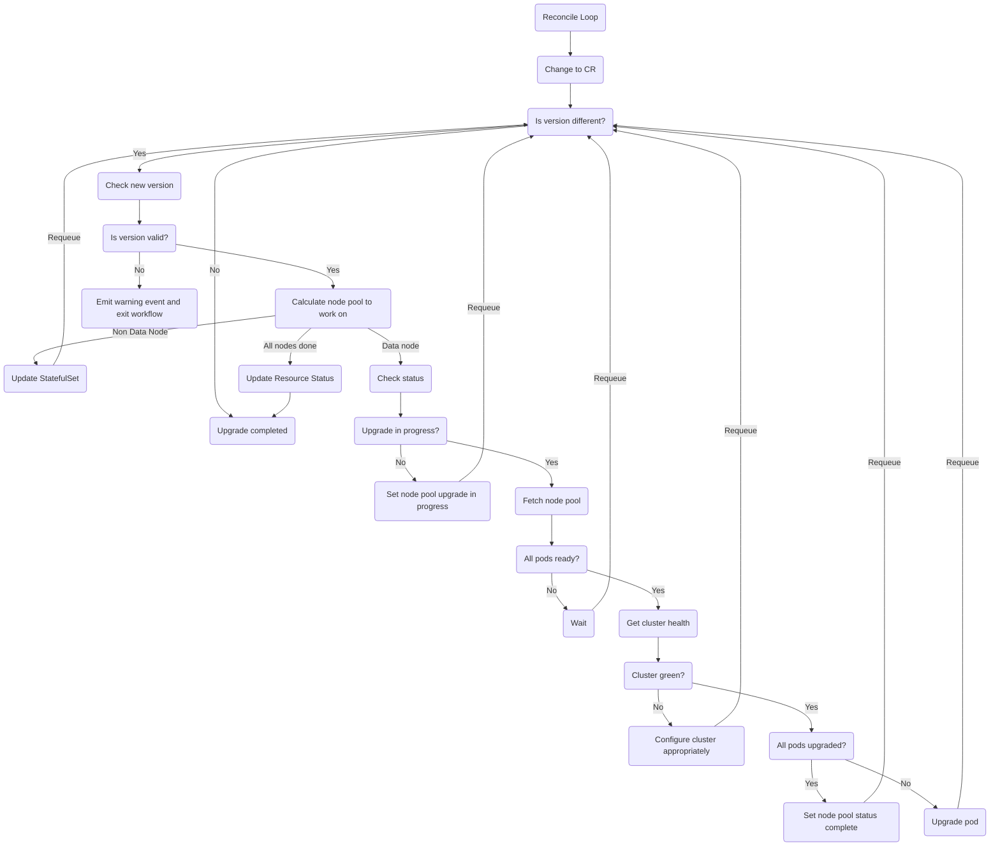

# Upgrade reconciler

The upgrade reconciler manages upgrades to the opensearch cluster

## Reconciler Logic flow

```mermaid
flowchart TD
    a0(Reconcile Loop) --> a1
    a9 -->|Requeue| a2
    b4 -->|Requeue| a2
    b7 -->|Requeue| a2
    b8 -->|Requeue| a2
    b9 -->|Requeue| a2
    c1 -->|Requeue| a2
    a1(Change to CR) --> a2(Is version different?)
    a2 -->|Yes| a3(Check new version)
    a2 ---->|No| c3
    a3 --> a5(Is version valid?)
    a5 -->|Yes| a6(Calculate node pool to work on)
    a5 -->|No| a7(Emit warning event and exit workflow)
    a6 -->|Data node| a8(Check status)
    a8 --> c4(Upgrade in progress?)
    c4 -->|Yes| b1(Fetch node pool)
    c4 -->|No| a9(Set node pool upgrade in progress)
    b1 --> b2(All pods ready?)
    b2 -->|Yes| b3(Get cluster health)
    b2 -->|No| b4(Wait)
    b3 --> b5(Cluster green?)
    b5 -->|Yes| b6(All pods upgraded?)
    b5 -->|No| b7(Configure cluster appropriately)
    b6 -->|Yes| b8(Set node pool status complete)
    b6 -->|No| b9(Upgrade pod)
    a6 -->|Non Data Node| c1(Update StatefulSet)
    a6 -->|All nodes done| c2(Update Resource Status)
    c2 --> c3(Upgrade completed)
```