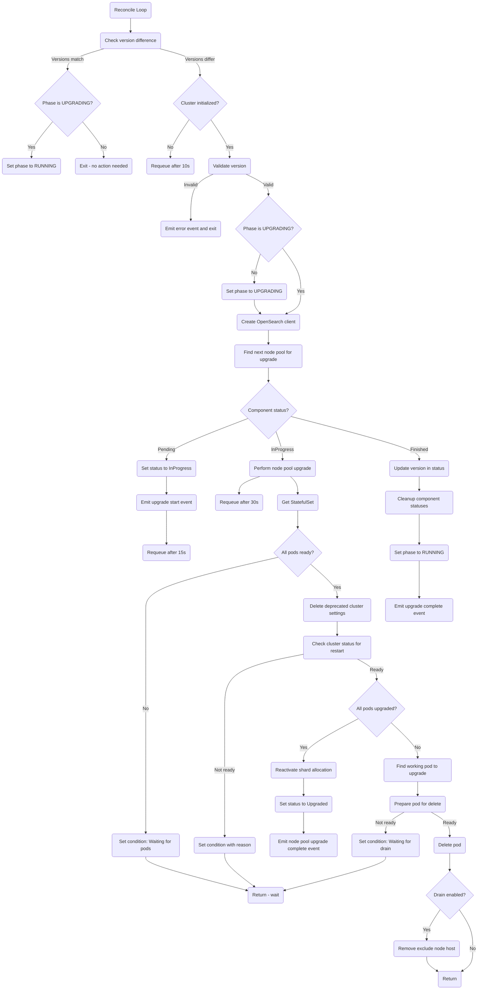

# Upgrade reconciler

The upgrade reconciler manages upgrades to the opensearch cluster

## Reconciler Logic flow

## Principles for Rolling upgrade

The upgrade principles follow the recommendations for completing a rolling upgrade of an OpenSearch cluster.  Namely:
 - Cluster nodes should be upgraded one at a time
 - The cluster should be healthy before upgrading each node
 - Master eligible nodes should be upgraded last

We also include the additional logic:
 - The version should not be a downgrade (this is to prevent unsupported states)
 - The version should not jump more than one major version (again avoid unsupported states)
 - Nodes hosting shards (data nodes) should be upgraded first
 - If a data node will be retaining its persistent data during upgrade, shard allocation should be modified prior to upgrade to prevent any unnecessary shard relocations during the upgrade
 - If a data node will lose its persistent data during upgrade, i.e. it is using ephemeral storage, it should be drained of shards prior to upgrade.
 - The cluster must be initialized before an upgrade can begin
 - Deprecated cluster settings are removed before each pod upgrade to prevent upgrade deadlocks

## Upgrade reconciler design

To enable us to track version upgrades, and control the upgrades of nodepools we track the last successfully deployed version in the custom resource state.  We upgrade node pools one at a time in the following order:
 1. Node pools with the data role, but not master role
 1. Node pools with the data and master role
 1. Node pools without the data role

This means that some nodes (such as coordinating nodes) may get upgraded after master nodes, but this is a tradeoff to ensure that data nodes are upgraded first.

### Version validation

Before starting an upgrade, the reconciler validates the requested version:
- **Downgrade prevention**: The new version must not be less than the current version
- **Major version jump prevention**: The new version must not be more than one major version ahead of the current version

If validation fails, an error event is emitted and the upgrade is aborted.

### Phase management

The reconciler manages the cluster phase during upgrades:
- When a version difference is detected and validation passes, the phase is set to `UPGRADING`
- When all node pools are upgraded and versions match, the phase is set back to `RUNNING`
- If versions are in sync but phase is still `UPGRADING`, it is automatically corrected to `RUNNING`

### Node pool upgrade mechanism

Each node pool goes through three status states during upgrade:

1. **Pending**: The node pool has been identified as the next one to upgrade but upgrade hasn't started yet
2. **InProgress**: The node pool upgrade is actively being performed, pods are being upgraded one by one
3. **Finished/Upgraded**: All pods in the node pool have been upgraded

When a node pool is selected for upgrade:
- Its component status is set to `Pending` initially
- The status is then set to `InProgress` when upgrade begins
- The StatefulSet spec is modified to use the new image tag (this happens automatically when the cluster reconciler runs)
- Once all pods in the StatefulSet are upgraded (UpdatedReplicas == Replicas), the status is set to `Upgraded`
- When all node pools are upgraded, the version in the cluster status is updated and component statuses are cleaned up

### Node pool upgrade process

For each node pool in the `InProgress` state, the following steps are performed on each reconcile:

1. **Check pod readiness**: Ensure all pods in the StatefulSet are ready before proceeding
2. **Delete deprecated settings**: Remove cluster settings that have been archived in the new version to prevent upgrade deadlocks (see [OpenSearch issue #18515](https://github.com/opensearch-project/OpenSearch/issues/18515))
3. **Check cluster status**: Verify the cluster is ready for the next pod restart:
   - If cluster is green, proceed
   - If cluster is yellow, check if it's safe to restart (e.g., due to version mismatch during upgrade)
   - If `DrainDataNodes` is enabled and cluster is not green, wait
   - If shard allocation is disabled, enable it and wait
4. **Check upgrade completion**: If all pods are upgraded (UpdatedReplicas == Replicas):
   - Reactivate shard allocation if it was disabled
   - Set node pool status to `Upgraded`
   - Emit completion event
5. **Find working pod**: Identify the pod that needs to be upgraded (the one with the older revision)
6. **Prepare pod for delete**:
   - If `DrainDataNodes` is enabled:
     - Exclude the node from shard allocation
     - For 2-node clusters: wait for system index primaries to drain
     - For larger clusters: wait until the node is safe to delete (no shards or only version-mismatched replicas)
   - If `DrainDataNodes` is disabled:
     - Set shard allocation to primaries only
7. **Delete pod**: Once the pod is prepared, delete it to trigger recreation with the new image
8. **Cleanup**: If draining was enabled, remove the node exclusion after pod deletion

### Component conditions

During the upgrade process, the reconciler tracks detailed conditions for each node pool being upgraded. These conditions provide visibility into what the reconciler is waiting for:
- "Waiting for all pods to be ready"
- "Could not delete unsupported cluster settings"
- "Could not check opensearch cluster status"
- Cluster health status messages
- "preparing for pod delete"
- "Could not find working pod"
- "Could not prepare pod for delete"
- "Waiting for node to drain"
- "Could not delete pod"
- "Deleted pod {podName}"

### StatefulSet Requirements

Due to the requirements to check cluster status and complete additional actions on each data node pod before it is upgraded we need fine grained control over when each pod is deleted.  To achieve this we use the [OnDelete update strategy](https://kubernetes.io/docs/concepts/workloads/controllers/statefulset/#update-strategies).  This lets us have complete control over when a pod in a StatefulSet is deleted and replaced.

The cluster reconciler updates the StatefulSet image when it detects a version change, but with OnDelete strategy, pods are not automatically replaced. The upgrade reconciler manually deletes pods after performing the necessary pre-checks and preparations.

For non-data nodes the only requirement is that the pods in each node pool are upgraded one at a time and each pod is ready before the next one is upgraded.  This behaviour is already built in to the Kubernetes StatefulSet controller with the [RollingUpdate](https://kubernetes.io/docs/concepts/workloads/controllers/statefulset/#rolling-updates) update strategy and the default [OrderedReady](https://kubernetes.io/docs/concepts/workloads/controllers/statefulset/#orderedready-pod-management) pod management strategy.  By including a readiness check in the pod spec this means the pods won't be deleted and upgraded until the previous pod is ready and working.

### Requeue intervals

The reconciler uses different requeue intervals based on the upgrade state:
- **Pending → InProgress transition**: 15 seconds
- **InProgress state**: 30 seconds (allows time for pod deletion, recreation, and readiness)
- **Cluster not initialized**: 10 seconds

### Special considerations

- **Two-node clusters with draining**: If a cluster has only 2 data nodes and `DrainDataNodes` is enabled, some shards may not drain completely. The reconciler logs a warning in this case and only waits for system index primaries to drain.
- **Yellow cluster state during upgrade**: During upgrades, a cluster may remain yellow because replicas cannot be allocated to non-upgraded nodes when primaries are on upgraded nodes. The reconciler detects this safe condition and allows the upgrade to proceed.
- **Deprecated settings cleanup**: Before each pod deletion, deprecated cluster settings are removed. This is necessary because some settings are re-applied automatically during node restart, and archived settings can cause update failures.