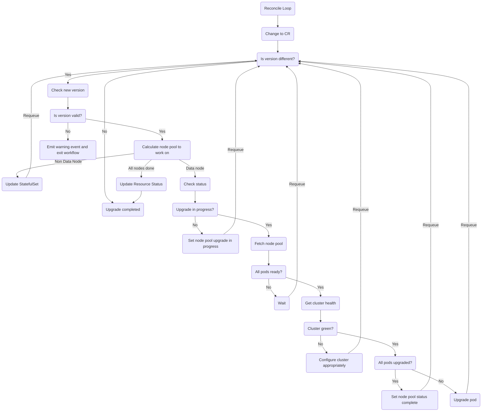

# Upgrade reconciler

The upgrade reconciler manages upgrades to the opensearch cluster

## Reconciler Logic flow

## Principals for Rolling upgrade

The upgrade principals follow the recommendations for completing a rolling upgrade of an Opensearch cluster.  Namely:
 - Cluster nodes should be upgraded one at a time
 - The cluster should be healthy before upgrading each node
 - Master eligible nodes should be upgraded last

We also include the additional logic:
 - The version should not be a downgrade (this is to prevent unsupported states)
 - The version should not jump more than one major version (again avoid unsupported states)
 - Nodes hosting shards (data nodes) should be upgraded first
 - If a data node will be retaining its persistent data during upgrade, shard allocation should be modified prior to upgrade to prevent any unnecessary shard relocations during the upgrade
 - If a data node will lose its persistent data during upgrade, i.e. it is using ephemeral storage, it should be drained of shards prior to upgrade.

## Upgrade reconciler design

To enable us to track version upgrades, and control the upgrades of nodepools we track the last successfully deployed version in the custom resource state.  We upgrade node pools one at a time in the following order:
 1. Node pools with the data role, but not master role
 1. Node pools with the data and master role
 1. Node pools without the data role

This means that some nodes (such as coordinating nodes) may get upgraded after master nodes, but this is a tradeoff to ensure that data nodes are upgraded first.

### Node pool upgrade mechanism

When a node pool is selected for upgrade its component status is set to upgrading.  At this point the Statefulset spec will be modified to use the new image tag.  Once the Statefulset  has been successfully updated the component status is set to upgraded so it will be excluded in further node pool selections.  Until a node pool is set as upgrading the image tag will be set to the version stored in the resource state.
### Statefulset Requirements

Due to the requirements to check cluster status and complete additional actions on each data node pod before it is upgraded we need fine grained control over when each pod is deleted.  To achieve this we use the [OnDelete update strategy](https://kubernetes.io/docs/concepts/workloads/controllers/statefulset/#update-strategies).  This lets us have complete control over when a pod in a Statefulset is deleted and replaced.

For non-data nodes the only requirement is that the pods in each node pool are upgraded one at a time and each pod is ready before the next one is upgraded.  This behaviour is already built in to the Kubernetes Statefulset controller with the [RollingUpdate] (https://kubernetes.io/docs/concepts/workloads/controllers/statefulset/#rolling-updates) update strategy and the default [OrderedReady](https://kubernetes.io/docs/concepts/workloads/controllers/statefulset/#orderedready-pod-management) pod management strategy.  By including a readiness check in the pod spec this means the pods won't be deleted and upgraded until the previous pod is ready and working.